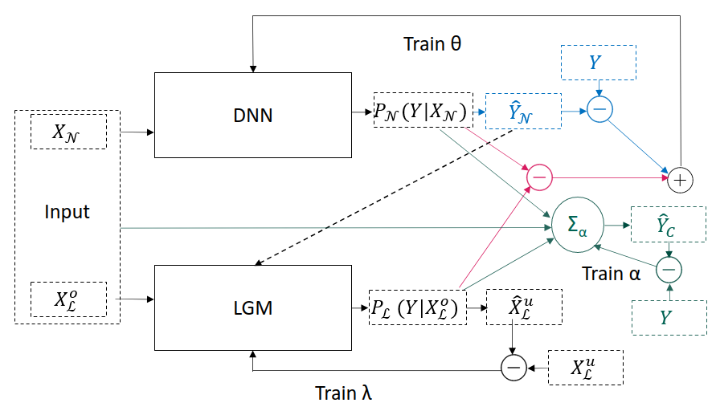

# Concordia - a neuro-symbolic framework

Concordia is a neuro-symbolic architecture that combines lifted graphical models and neural networks. The goal is to distill additional knowledge into a neural network in the form of rules. Concordia consists of three main parts, which are coded into classes:

1. [Teacher](#Teacher) - the lifted graphical model. So far, we have implemented only Probabilistic Soft Lofic (PSL) models, however, it can easily extended to other lifted graphical models such as Markov Logic Networks (MLNs).
2. [Student](#Student) - the neural model. This can be any type of Deep Neural Network and the architecture has been developed for easy integration of different models. So far, only classification tasks has been tested, but regression is an easy extension.
3. [Concordia Network](#Concordia-Network) - the main class that takes the outputs of each individual solver backpropagates their output respectively to the other and combines the outputs through a mixture-of-experts approach to give a unified prediction.



## Content

1. [Repo Structure](#repo-structure)
2. [Teacher](#teacher)
3. [Student](#student)
4. [Concordia Network](#concordia-network)
5. [Additional Files](#additional-files)
6. [Installation and Set-Up](#installation)
7. [Experiments](#experiments)

## Repo Structure

The Repo is split into two folders: `Concordia` and `Experiments`. `Concordia` contains all the necessary files to use this architecture. The `Experiments` folder contains all the experiments run in this paper. Running new datasets would simply consist in inserting the data, the desired neural model, and the rules in the corresponding folders.

All files in Concordia are described below. The Experiments folder is set up the following way:

Each experiment has its own folder, e.g. `CollectiveActivity`. Inside, Concordia expects a `data` folder, with the data being split between the data for the `student` and the `teacher` and inside between training and testing data respectively. 

Inside the `teacher` folder, in addition, you will find a `model` folder, which contains a `model.psl` file containing the rules, and if trained ahead of time their respective weights, and a `predicates.psl` describing all predicates and their arguments in the model, i.e.

```
/data
  /student
	/test
	/train
  /teacher
	/model
	  .model.psl
	  .predicates.psl
	/test
	/train
```

In addition, inside the respective experiment folde, you will find a `data_processing` folder. This folder is not necessary, but can be used to set up the data pre-processing.

Finally, there is a `NeuralNetworkModels` folder containing all the neural models that you might want to use for the student.


## Teacher

The `Teacher` class is a wrapper class for a lifted graphical model it is an abstract class allowing in the future to implement several instances of teachers. So far, we have implemented a `PSLTeacher`. 

### Useage

The `Teacher` has the following form

```
Teacher(knowledge_base_factory, predicates=None, predicates_to_infer=None, **config)
```

where 

- `knowledge_base_factory` is an object that, from a list of predicates and raw data, grounds all possible atoms,
- `predicates` is a list of all predicates in the knowledge base,
- `predicates_to_infer` are the predicates that the overarching architecture is interested in inferring, and
- `**config` is a configuration file, which typically is the same as for the whole architecture.

### Methods

The `Teacher` class has the following methods:

* `_build_model` used during instantion of a Teacher to create the model from the `model.psl` and `predicates.psl` file. These files are expected to be found in `/Experiments/{Experiment}/teacher/model/`.
* `__str__` allows for the useage of `print(Teacher)` printing the model to the terminal.
* `write_model_to_file` prints the rules and their weights to a specified file.
* `fit` trains the weights of the rules
* `predict` predicts all unknown variables and then returns the variables of interest as specified in the instantiation.

## Student

The `Student` class is a very simple wrapper class for any neural model.

### Useage

The `Student` is instantiated the following way

```
Student(neural_model, student_loss_function, optimizer)
```

where

- `neural_model` is a neural model object that you can specify,
- `student_loss_function` is the function that the model should use to calculate the loss between its predictions and the true labels, and
- `optimizer` is an optimizer of your choice. By default we set it to Adam with its default values.

It is instantiated with a neural model of your choice. We have provided a couple of neural models, which you can find in `/Experiments/CollectiveActivity/NeuralNetworkModel`. Those are taken from the [Improved Actor Relation Graph based Group Activity Recognition](https://github.com/kuangzijian/Improved-Actor-Relation-Graph-based-Group-Activity-Recognition) repo.

### Methods

The student has the following methods:

* `__str__` which prints the model to the terminal,
* `write_model_to_file` which prints the model to a specified file,
* `fit` backpropagates the loss to the model, and
* `predict` which for some input predicts the labels. It outputs the predictions as a loss as several tasks can be given to the neural network. For example, in the collective activity task, the neural model predicts both individual actions as well as group actions.

## Concordia-Network

The $ConcordiaNetwork class combines the two solvers. Firstly, it takes the outputs of the 